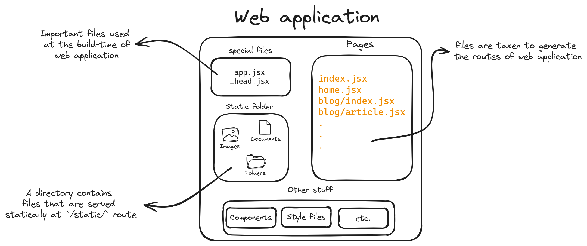

# MetaSSR Folder Structure

Understanding the folder structure of a MetaSSR project is crucial for effective development and organization. This guide provides an overview of the default structure and the purpose of each directory and file.

## Table of Contents

- [Overview](#overview)
- [Root Directory](#root-directory)
    - [src](#src)
    - [pages](#pages)
    - [Special Files](#special-files)
    - [static](#static)
    - [dist](#dist)

## Overview

When you create a new MetaSSR project, the framework sets up a standard folder structure to organize your code and resources. This structure helps manage your application logic, static files, build outputs, and configurations in a clean and scalable way.



## Root Directory

The root directory contains the core configuration files and directories necessary for your project. It typically looks like this:

```plaintext
my-metassr-project/
│
├── src/
├── static/
├── dist/
├── node_modules/
├── package.json
└── README.md
```

### src

The `src` directory contains the main source code for your application. Here, you'll write your server-side logic, React components, and other core functionalities.

```plaintext
my-metassr-project/
└── src/
    ├── pages/
    ├── _head.jsx
    └── _app.jsx
```

- **_app.jsx**: The entry point for your application.
- **_head.jsx**: Contains the content of the HTML header for global pages.

### pages

The `pages` directory is a crucial part of the MetaSSR project. It contains the React components that represent different pages in your application. Each file inside this directory corresponds to a specific route in your application.

```plaintext
my-metassr-project/
└── src/
    └── pages/
        ├── index.jsx
        └── about.jsx
```

- **index.jsx**: Typically represents the homepage of your application.
- **about.jsx**: An example of a secondary page in your application.

These files will be automatically mapped to the respective routes, such as `/` for `index.jsx` and `/about` for `about.jsx`.

### Special Files

MetaSSR uses several special files that help customize the behavior and appearance of your application across different pages:

- **_app.jsx**: This file serves as the main entry point for your application. It wraps all the pages in your application, layout, and other shared functionality. Any changes made here will apply across your entire application.

- **_head.jsx**: This file contains the content for the HTML `<head>` tag, which is included on every page. It's the place to include global meta tags, styles, and scripts that should be consistent across all pages.

- **pages/_notfound.jsx**: This is a special page component that handles 404 errors when a user navigates to a route that doesn't exist. It helps provide a custom and user-friendly error page instead of a generic browser error.

```plaintext
my-metassr-project/
└── src/
    ├── _head.jsx
    ├── _app_.jsx
    └── pages/
        ├── _notfound.jsx
        ├── index.jsx
        └── about.jsx
```

### static

The `static` directory holds static assets like images, fonts, and other files that won't change during runtime. These files are served directly to the client.

```plaintext
my-metassr-project/
└── static/
    ├── images/
    ├── css/
    └── favicon.ico
```

This directory is served under the `/static/` endpoint like this:
```
localhost:<PORT>/static/favicon.ico
```

### dist

The `dist` directory is where the compiled output of your project is stored after running [the build command](./cli.md#build). It contains the optimized and minified versions of your assets and code. It's used to render your web application on the server-side.

```plaintext
dist/
├── cache
│   ├── head.js
│   ├── head.js.map
│   └── pages
│       ├── index.js
│       ├── index.server.css
│       ├── index.server.css.map
│       ├── index.server.js
│       ├── index.server.js.map
│       └── _notfound
│           ├── index.js
│           ├── index.server.css
│           ├── index.server.css.map
│           ├── index.server.js
│           └── index.server.js.map
├── manifest.json
└── pages
    ├── index.js.css
    ├── index.js.css.map
    ├── index.js.js
    ├── index.js.js.map
    └── _notfound
        ├── index.js.css
        ├── index.js.css.map
        ├── index.js.js
        └── index.js.js.map
```

---

By understanding and utilizing the default folder structure of MetaSSR, you'll be able to maintain a clean and scalable codebase, making your development process smoother and more efficient.
